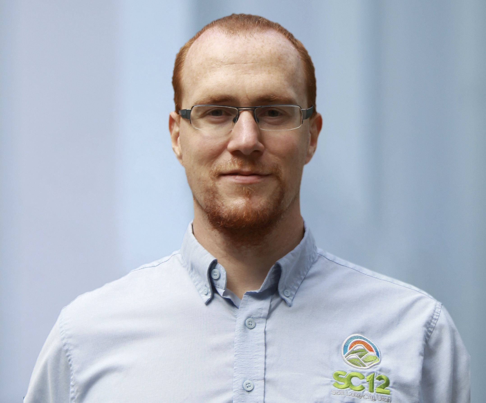

# Keynote Speakers

The conference will feature two keynote presentations by:

* [Kosuke Tatsumura](#tatsumura), Toshiba Corporation on **Large-scale combinatorial optimization in real-time systems by FPGA-based accelerators for simulated bifurcation**, and
* [Torsten Hoefler](#hoefler), ETH Zurich on **Portable high-performance Python on CPUs, GPUs, and FPGAs**

## Kosuke Tatsumura, Chief Research Scientist, Corporate Research and Development Center, Toshiba Corporation##

### Large-scale combinatorial optimization in real-time systems by FPGA-based accelerators for simulated bifurcation

#### Abstract

Combinatorial optimization problems are economically valuable but computationally hard to solve. Many practical combinatorial optimizations can be converted to ground-state search problems of Ising spin models. Simulated bifurcation (SB) is a quantum-inspired algorithm to solve these Ising problems. One of the remarkable features of SB is the high-degree parallelism, providing an opportunity for quickly solving those problems by massively parallel processing. In this talk, starting from the principles of SB, we review our recent works on the design and implementation of high-performance FPGA-based accelerators for SB and their applications toward innovative real-time systems that make optimal responses to ever-changing situations. An example of such applications is an ultrafast financial transaction machine that detects the most profitable cross-currency arbitrage opportunities at microsecond speeds. Also, we discuss the parallelism of SB in depth and show a scale-out architecture for SB-based Ising machines with all-to-all spin-spin couplings that allows continued scaling of both machine size and computational throughput by connecting multiple chips, rather than scaling up a single chip.

#### Bio

Kosuke Tatsumura is Chief Research Scientist at Corporate R&D Center, Toshiba Corporation. He received the B.E., M.E., and Ph.D. degrees in Electronics, Information and Communication Engineering from Waseda University, Japan, in 2000, 2001, and 2004, respectively. After working as a postdoctoral fellow at Waseda University, he joined Toshiba Corporation in 2006. He was a member of the Emerging Research Devices (ERD) committee in International Technology Roadmap for Semiconductors (ITRS) from 2013 to 2015. He was a visiting researcher at the University of Toronto from 2015 to 2016. He received the Best Paper Award at IEEE Int. Conf. on Field-Programmable Technology (FTP) in 2016. He has been a lecturer at Waseda University since 2013. In Toshiba Corporation, he is leading a research group named Domain-specific computing, mainly developing FPGA-based accelerators for innovative industrial systems. He is also in charge of creating new businesses based on cutting-edge technology.

## Torsten Hoefler, ETH Zurich ##

### Portable high-performance Python on CPUs, GPUs, and FPGAs

#### Abstract

Python has become the de-facto language for scientific computing. Programming in Python is highly productive, mainly due to its rich science-oriented software ecosystem built around the NumPy module. As a result, the demand for Python support in High Performance Computing (HPC) has skyrocketed. However, the Python language itself does not necessarily offer high performance. In this work, we present a workflow that retains Python’s high productivity while achieving portable performance across different architectures. The workflow’s key features are HPC-oriented language extensions and a set of automatic optimizations powered by a data-centric intermediate representation. We also define a set of around 50 benchmark kernels written in NumPy to evaluate and compare Python frameworks for their portability and performance. We show performance results and scaling across CPU, GPU, FPGA, with 2.47x and 3.75x speedups over previous-best solutions and the first-ever Xilinx and Intel FPGA results of annotated Python.

#### Bio

Torsten Hoefler is a Professor of Computer Science at ETH Zürich, Switzerland. He is also a key member of the Message Passing Interface (MPI) Forum where he chairs the "Collective Operations and Topologies" working group. His research interests revolve around the central topic of "Performance-centric System Design" and include scalable networks, parallel programming techniques, and performance modeling. Torsten won best paper awards at the ACM/IEEE Supercomputing Conference SC10, SC13, SC14, SC19, EuroMPI'13, HPDC'15, HPDC'16, IPDPS'15, and other conferences. He published numerous peer-reviewed scientific conference and journal articles and authored chapters of the MPI-2.2 and MPI-3.0 standards. He received the Gordon Bell Prize, the Latsis prize of ETH Zurich, as well as ERC starting and consolidator grants. Additional information about Torsten can be found on his homepage at htor.inf.ethz.ch.

